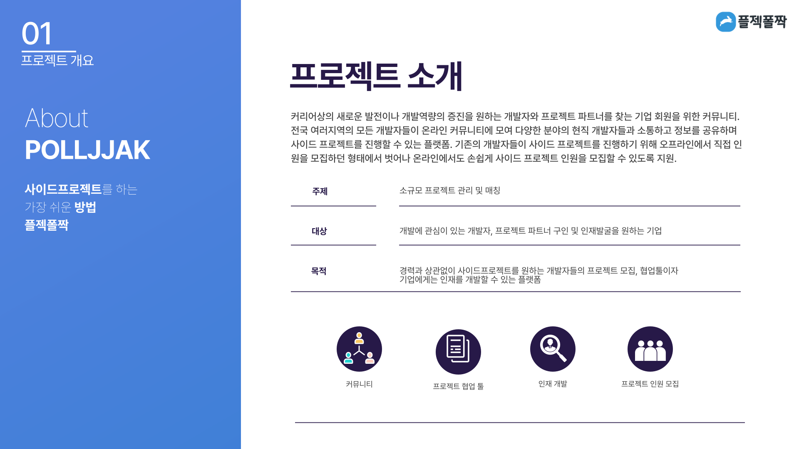
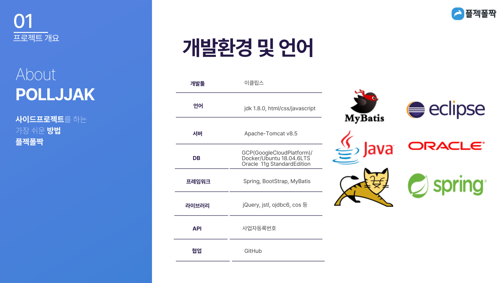
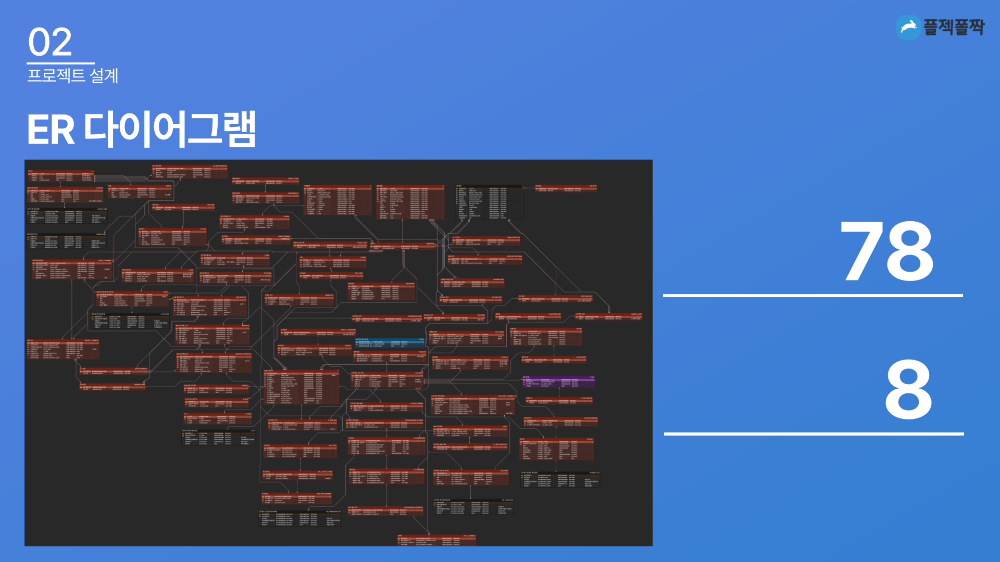
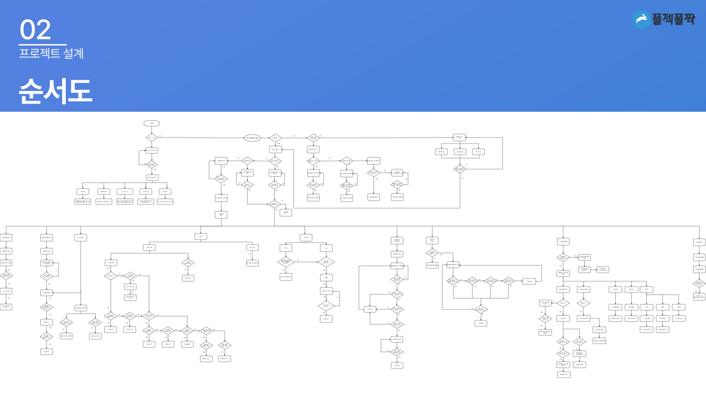
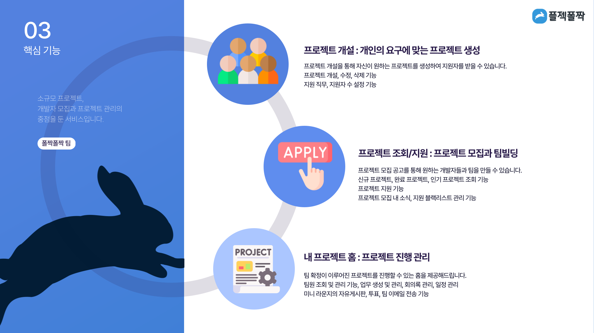
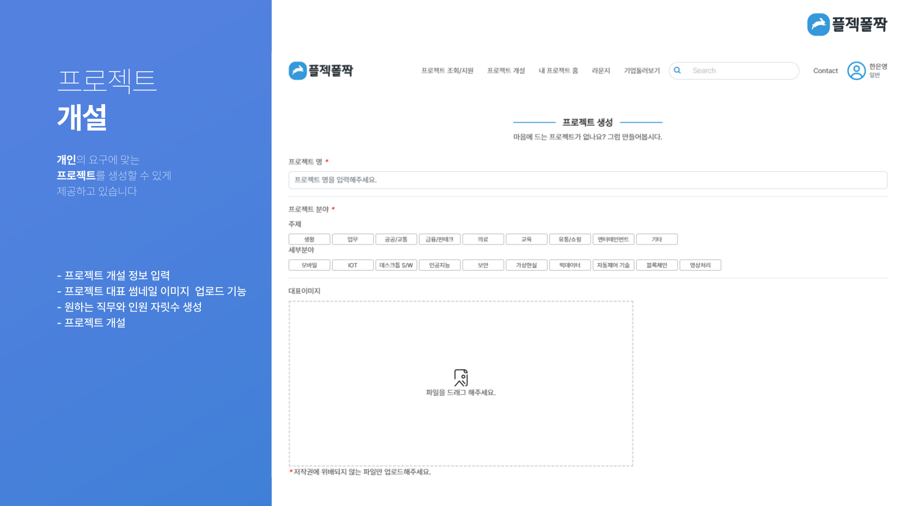
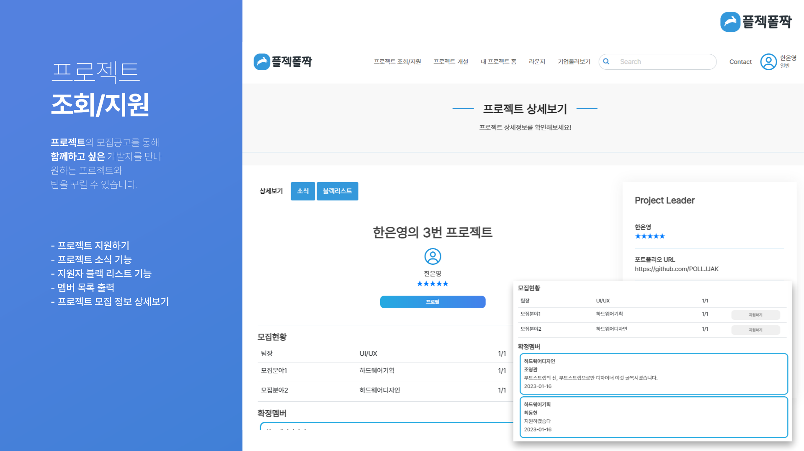
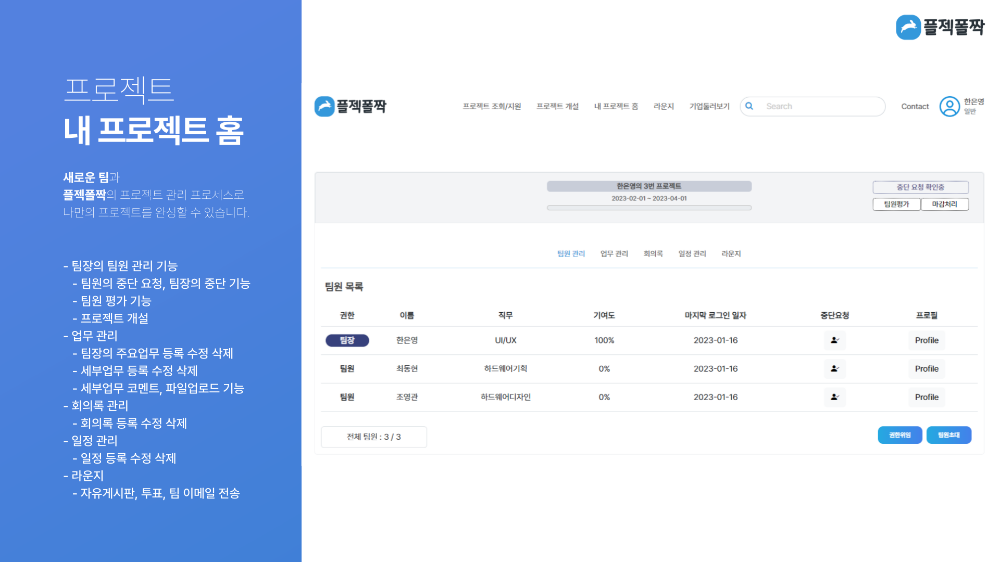
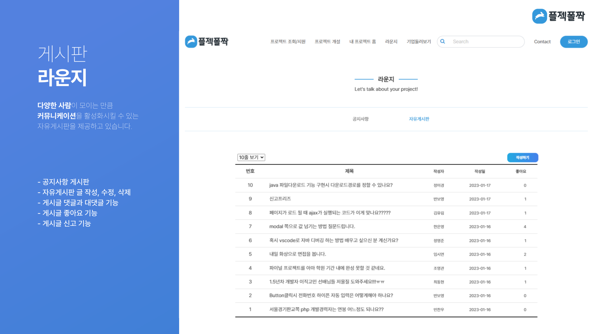

# 사이드 프로젝트를 하는 가장 쉬운 방법, 플젝폴짝 🐇
### 파이널 프로젝트 - 소규모 프로젝트 매칭 및 관리 프로그램
> <b>※ 2023.01.15 : 수료 후에도 프로젝트 완성을 위해 현재 진행 중입니다. </b>

### 프로젝트 소개
- 경력과 상관없이 사이드 프로젝트를 원하는 개발자들의 프로젝트 모집과 협업활동에 기여하고 기업에게는 인재를 모색하고 개발할 수 있는 서비스를 제공하는 플랫폼

### 개발환경 및 언어
- IDE : Eclipse IDE for Enterprise Java Developers 
- Language : JDK 1.8, HTML5, CSS3, JavaScript
- DB : GCP(GoogleCloudPlatForm), Docker, Ubuntu 18.04.6LTS, Oracle 11g Standard Edition
- WAS : Apache Tomcat-8.5.54
- Framework : Spring Framework 3.0.2, MyBatis, BootStrap, 
- API : 사업자 등록 번호

### 프로젝트 목표
1. 
2.
3.

### 팀 소개
- 쌍용강북교육센터 B강의장
- 4조 : `팀장` [한은영](https://github.com/prtey), [김유림](https://github.com/doxxxdim), [김인교](https://github.com/rokatee), [박원석](https://github.com/jp0301)

### 팀 역할
- 
-
-
-

 

### 프로젝트 소개 자료

 

### 웹 실행 화면

